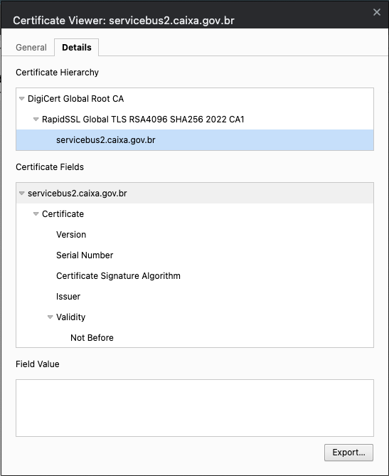

# Bolões : Loterias

## Descrição
Projeto para gerar jogos de loteria.


## Observações:
Para converter o HTML com os resultados dos jogos da CEF utilizou-se do site ()[https://www.convertjson.com/html-table-to-json.htm]

## Configuração

### Instalação do certificado público SSL da CEF
Em **Dez/2022**, o serviço que fornece os resultados dos jogos exige o uso de um certicado público SSL especifico.

Este serviço esta na URL <https://servicebus2.caixa.gov.br/portaldeloterias/api/>.

#### Obter certificado público SSL
O atual certificado válido (`servicebus2.caixa.gov.br.cer`) esta gravado no diretório `resources/ssl/` do projeto.

**Observação**: Este certificado expira em **4º-feira, 14 de junho de 2023, as 20:59:59 horário de Brasília**.

Para baixar um novo certificado devemos seguir os seguintes passos:

- Abra a URL <https://servicebus2.caixa.gov.br/portaldeloterias/api/> em um navegador Chrome;

- Clique no cadeado ao lado da URL;


- Selecione o item 'Connection is secure';


- Selecione o item 'Certificate is valid';

- Seleciona a aba 'Details';

- Selecione o certificado de nome `servicebus2.caixa.gov.br.cer`;

- Clique no botão 'Export';




#### Instalar no servidor
Para instalar o certificado SSL devemos executar o seguinte comando:

```console
$ ./keytool -importcert -alias "servicebus2.caixa.gov.br.cer" -keystore {JAVA_HOME}/lib/security/cacerts -file {PathToDownloads}/servicebus2.caixa.gov.br.cer
```